<div align="center">



<p>
  <a href="https://github.com/Shameen-Khan">
    
  </a>
  <a href="https://leetcode.com/u/SHAMEENKHAN/">
    
  </a>
  <a href="https://www.linkedin.com/in/shameenkhan-j">
    
  </a>
  <a href="https://www.instagram.com/shameen_writes/">
    
  </a>
</p>


</div>

---

<div align="center">

## 🧠 A LITTLE ABOUT ME

**B.E. Computer Science & Engineering (AI & ML)**  ·  **Problem Solver**  ·  **Builder**

I like the part of engineering where an idea stops being an idea and becomes something that actually works.

</div>


## ⚡ WHAT DEFINES MY WORK

<table align="center">
<tr>
<td align="center" width="33%"><b>🤖 THINK</b><br/>AI / ML<br/>Patterns &amp; Models<br/>Problem Solving</td>
<td align="center" width="33%"><b>🛠️ BUILD</b><br/>Full-Stack Apps<br/>Experiments<br/>Practical Projects</td>
<td align="center" width="33%"><b>🚀 IMPROVE</b><br/>DSA Practice<br/>Clean Code<br/>Continuous Learning</td>
</tr>
</table>

## 🧬 MY TECH DNA

<div align="center">


</div>

## 🎯 CURRENTLY EXPLORING

```text
AI / ML                 ███████████████░░░  building stronger fundamentals
DSA                     ████████████████░░  solving and recognizing patterns
Full-Stack Development  ████████████░░░░░░  learning by building
Python                  █████████████████░  primary problem-solving language
Java                    ███████████░░░░░░░  strengthening OOP + DSA
C                       ██████████░░░░░░░░  sharpening core fundamentals
```

## 🧩 PROBLEM-SOLVING LAB

I use LeetCode to sharpen **Data Structures & Algorithms**, understand reusable patterns, and improve how I think about time and space complexity.

<div align="center">

<a href="https://leetcode.com/u/SHAMEENKHAN/">

</a>

<a href="https://github.com/Shameen-Khan/LeetCode">

</a>

</div>

## 🌌 GITHUB ACTIVITY

<div align="center">


<br><br>


</div>

## 🚀 WHAT I'M BUILDING TOWARD

> **Learn deeply. Build boldly. Solve better.**

I’m working toward becoming a developer who can move comfortably between **AI/ML, algorithms, and real-world software development** rather than being limited to one narrow stack.

## 🔮 THE NEXT VERSION OF THIS PROFILE

As the repositories grow, this space will evolve with them — real projects, real experiments, real solutions, and real progress.

<div align="center">

### 💜 There is no “final version”.
### The profile is a live build.

<br>

<a href="https://github.com/Shameen-Khan">

</a>

</div>
