---

## 👋 ABOUT ME

I'm a **B.E. Computer Science and Engineering (AI & ML)** student focused on building strong programming fundamentals and turning ideas into practical software.

- 🤖 Exploring **Artificial Intelligence & Machine Learning**
- 💻 Practicing **Data Structures & Algorithms** through LeetCode
- 🌐 Learning **Full-Stack Development**
- 🐍 **Python** · ☕ **Java** · ⚙️ **C**
- 🧠 Interested in practical, real-world applications
- 🚀 Improving through projects, problem solving and experimentation

## 🛠️ TECHNOLOGY STACK

## 🎯 CURRENT FOCUS

| 🤖 AI / ML | 💻 DSA | 🌐 FULL STACK |
|:---:|:---:|:---:|
| Machine Learning | Algorithms | Frontend |
| AI Projects | LeetCode | Backend |
| Model Building | Problem Solving | APIs |

## 🔥 CONTRIBUTION STREAK

## 📈 CONTRIBUTION ACTIVITY

## 🐍 CONTRIBUTION SNAKE

## 🚀 WHAT I'M BUILDING TOWARD

- Strong **DSA and problem-solving** fundamentals
- Practical **AI/ML applications**
- Solid **full-stack development** skills
- Meaningful **open-source contributions**
- A portfolio of real-world software projects

## 🧩 PROBLEM SOLVING

I use LeetCode to strengthen **Data Structures & Algorithms**, understand reusable problem-solving patterns, and improve time and space complexity awareness.

**→ [View my LeetCode solutions](https://github.com/Shameen-Khan/LeetCode)**

## 🤝 CONNECT

 

### 💜 Build. Learn. Experiment. Repeat.

<i>One problem. One project. One improvement at a time.</i>

