<div align="center">


<p>
  <a href="https://github.com/Shameen-Khan"></a>
  <a href="https://leetcode.com/u/SHAMEENKHAN/"></a>
  <a href="https://www.linkedin.com/in/shameenkhan-j"></a>
  <a href="https://www.instagram.com/shameen_writes/"></a>
</p>


</div>

---

## 🌌 Portfolio site

The repository also contains a self-contained single-page portfolio in `index.html`, with responsive styling in `styles.css` and the persistent interactive Three.js universe in `script.js`. It is a vanilla HTML/CSS/ES module app (no build system).

The scene includes original local nebula artwork in `assets/nebula-carina.svg`, `assets/nebula-pillars.svg`, and `assets/nebula-ring.svg`. These are layered as transparent Three.js textures at different depths alongside the procedural planet, shuttle, satellite, particles, and camera travel. Their amber/copper, cyan, and deep-blue palette is an original interpretation of the supplied Webb nebula descriptions, not a NASA image reproduction.

### Preview locally

No build step is required. Open `index.html` directly in a browser, or serve the repository folder with any static server:

```bash
python -m http.server 8000
```

Then visit `http://localhost:8000`. The scene uses Three.js `0.161.0` from jsDelivr via an import map. Navigation destinations are hash URLs (`#home`, `#about`, `#skills`, `#projects`, `#writing`, `#achievements`, `#contact`) and retain the persistent WebGL canvas while the camera travels between coordinates. The Motion toggle and `prefers-reduced-motion` both disable travel animation; a static CSS universe and all HTML content remain usable if WebGL is unavailable.

---

<div align="center">

## 🧠 A LITTLE ABOUT ME

**B.E. Computer Science & Engineering (AI & ML)**  ·  **Problem Solver**  ·  **Builder**

I like the part of engineering where an idea stops being an idea and becomes something that actually works.

</div>


## ⚡ WHAT DEFINES MY WORK

<table align="center">
<tr>
<td align="center" width="33%"><b>🤖 THINK</b><br/>AI / ML<br/>Patterns &amp; Models<br/>Problem Solving</td>
<td align="center" width="33%"><b>🛠️ BUILD</b><br/>Full-Stack Apps<br/>Experiments<br/>Practical Projects</td>
<td align="center" width="33%"><b>🚀 IMPROVE</b><br/>DSA Practice<br/>Clean Code<br/>Continuous Learning</td>
</tr>
</table>

## 🧬 MY TECH DNA

<div align="center">


</div>

## 🎯 CURRENTLY EXPLORING


```text
AI / ML                 ███████████████░░░  building stronger fundamentals
DSA                     ████████████████░░  solving and recognizing patterns
Full-Stack Development  ████████████░░░░░░  learning by building
Python                  █████████████████░  primary problem-solving language
Java                    ███████████░░░░░░░  strengthening OOP + DSA
C                       ██████████░░░░░░░░  sharpening core fundamentals
```

## 🧩 PROBLEM-SOLVING LAB

I use LeetCode to sharpen **Data Structures & Algorithms**, understand reusable patterns, and improve how I think about time and space complexity.

<div align="center">

<a href="https://leetcode.com/u/SHAMEENKHAN/"></a>
<a href="https://github.com/Shameen-Khan/LeetCode"></a>

</div>

## 🌌 GITHUB ACTIVITY

<div align="center">


<br><br>


</div>

## 🐍 CONTRIBUTION SNAKE

<div align="center">


</div>

## 🏆 CERTIFICATIONS

<div align="center">

<a href="https://drive.google.com/file/d/1RQvqpIVC_A5FVgtq1FLE6JxcSowUzONs/view?usp=drive_link"></a>
<a href="https://drive.google.com/file/d/1OcDfrQETdrnkbtzA34o3AdZHIbNzjrKq/view?usp=sharing"></a>

<a href="https://drive.google.com/file/d/10PLzersw1Wb5bNrcuz5kdNp66oWmV6_S/view?usp=sharing"></a>
<a href="https://drive.google.com/file/d/1rRRvDeaHK0dRXefnNEynSp9ZNUKQ0S2f/view?usp=drive_link"></a>

<br>

<a href="https://drive.google.com/drive/folders/1Ah4Pqwwus7iobKwaLDP9CrMMxO0FyvvB?usp=sharing"></a>

</div>

## 🚀 WHAT I'M BUILDING TOWARD

> **Learn deeply. Build boldly. Solve better.**

I’m working toward becoming a developer who can move comfortably between **AI/ML, algorithms, and real-world software development** rather than being limited to one narrow stack.

## 🔮 THE NEXT VERSION OF THIS PROFILE

As the repositories grow, this space will evolve with them — real projects, real experiments, real solutions, and real progress.

<div align="center">



</div>

## Featured achievements

The portfolio highlights Shameen Khan as a published author of *UNTITLED* with a [Notion Press author profile](https://notionpress.com/author/1557670), and as a TEDx speaker for *Why I Left My Book Untitled*, with the [TEDx talk available on YouTube](https://www.youtube.com/watch?v=t5KsyuXAtK4&t=3s).
